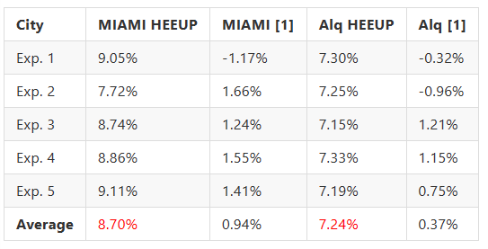

# Q2 Supplement

## Differences between HEEUP and [1].

| Difference   | HEEUP                                        | [1]                                      | Remarks                                     |
|--------------|----------------------------------------------|-----------------------------------------------|---------------------------------------------|
| Objective    | Minimize energy consumption for efficient urban layout | Adapt to complex terrain, optimize urban community spatial planning | Focus on energy efficiency vs. terrain adaptability |
| Strategy     | Hierarchical decision-making: from macro to micro optimization | Sequential decision-making: dynamic adaptation, continuous planning | Hierarchical vs. sequential decision-making process |
| State        | Comprehensive urban feature encoding (GAT+GAE), capturing full-spectrum multi-dimensional information | Progress and data encoding (GNN+Encoder), reflecting real-time planning dynamics | GAT enhances feature interrelation vs. GNN focuses on progress and statistics |
| Action       | Multi-dimensional actions, adjusting various aspects of urban planning from macro to micro | Focused on single decision-making for land use and roads | Multi-level refinement vs. single-point decision-making |
| Reward       | Energy efficiency as the core metric at each hierarchical level | Service quality, ecological balance, and traffic flow efficiency make up a composite reward system | Tiered focus on energy vs. diverse urban benefits |

## HEEUP v.s. [1] in energy saving.

In order to compare the energy-saving performance of the two, we performed EnergyPlus energy consumption simulation on the land use configuration generated by the respective strategies of HEEUP and [1].

Energy savings are measured based on a percentage improvement from the original land use configuration (real-world).

Energy Savings Percentage = $\frac{y - \hat{y}}{y} \times 100\\% $
in:
- $y$ represents the energy consumption of the original land use configuration.
- $\hat{y}$ represents the energy consumption generated by the model.
  
where positive values ​​indicate improved energy savings and negative values ​​indicate lower performance than the original configuration. We run five independent experiments (Exp.), and  present the results in the table below. The energy saving of our method HEEUP is more than 9x and 19x over [1] in two cities. HEEUP significantly outperforms the [1] strategy in terms of energy saving. This result clearly demonstrates the significant advantages of HEEUP in improving energy efficiency in optimizing urban layout.
  

**Table : Comparison of energy efficiency of HEEUP vs. [1]**

- **HEEUP** adopts a hierarchical, energy-saving optimization approach, progressing from Urban Structure -> Generate Land Use Configuration -> Adjust Building Design Parameters. Combine spatial attributes to carry out planning at all levels of decision-making to minimize energy consumption under reasonable layout.
- **[1]** employs a sequential decision-making model, addressing urban complexities and spatial planning needs. The urban identity is based on dynamic adaptation with a comprehensive reward system aimed at enhancing service delivery, ecological sustainability and transport efficiency.

In essence, HEEUP is engineered for energy optimization within urban layouts. While [1] multifaceted strategy to meet diverse urban service demands through adaptive spatial planning.
The results prove that HEEUP shows obvious advantages in promoting energy conservation.
